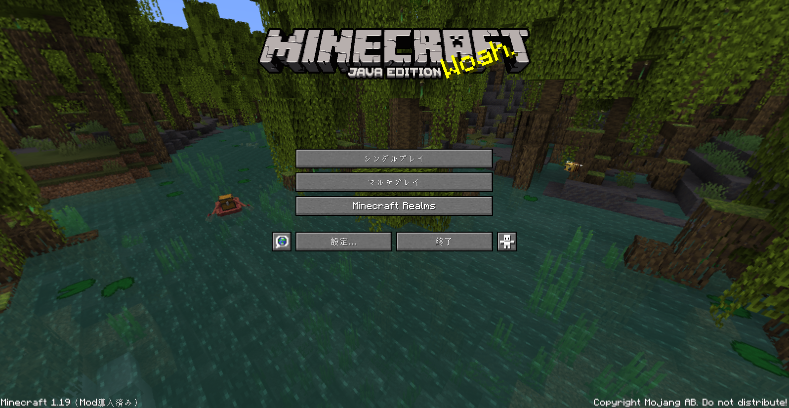
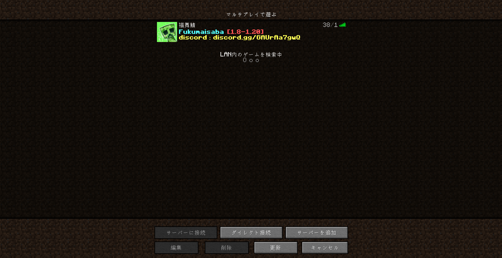
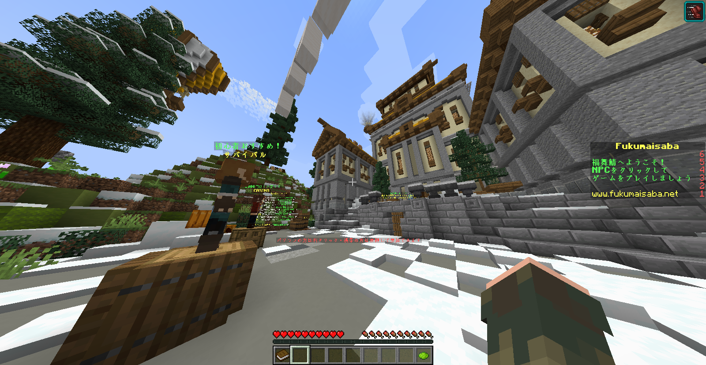
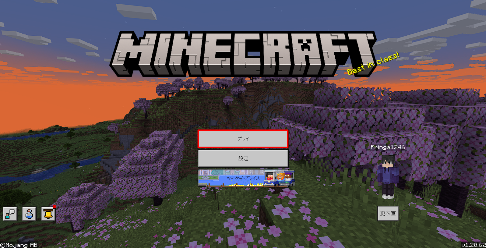
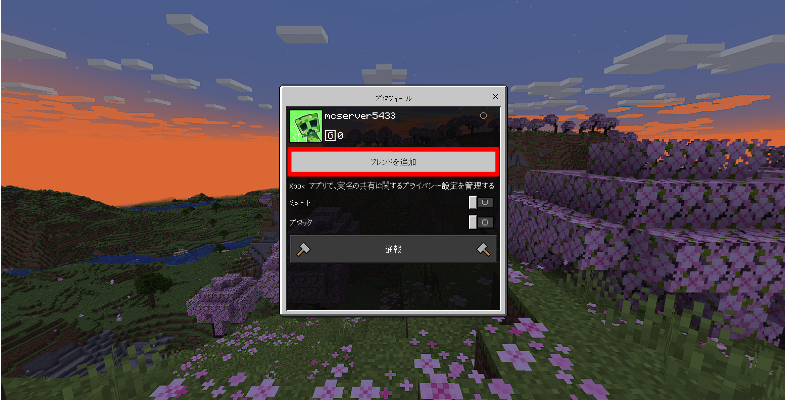
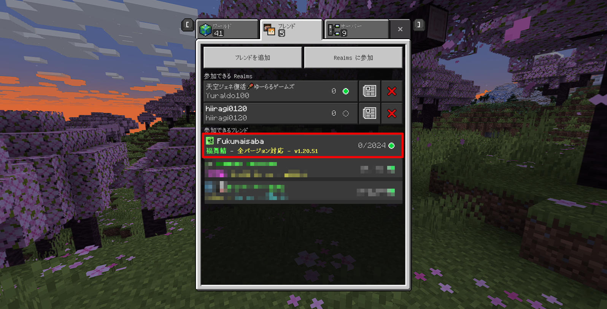

# 福舞鯖へ参加する方法！
java版・統合版 で福舞鯖に参加する方法を説明します。
 
 

## Java版の場合
1. MinecraftJava版 を起動し、マルチプレイ のメニューに移動します。

2. 次に、「サーバーの追加」をクリックします

3. `福舞鯖` などのサーバー名を入力し、サーバー IP: `mc.fukumaisaba.net`を入力して、[完了]をクリックします。

1. 追加したサーバーをダブルクリックするか、サーバーを選択して [サーバーに参加]をクリックします。

1. これで福舞鯖に参加できます！
また、[ルール](https://docs.fukumaisaba.net/rule/)しっかり読み楽しい福舞鯖を遊びましょう！

   

## 統合版の場合

1. Minecraft統合版 を起動し、`プレイ` を押して `フレンド` という項目をクリックします。

2. 次に、「フレンドを追加」をクリックして `mcserver5433` と入力してフレンド追加をしてください。

3. 追加をして1分ほど待つと、`福舞鯖` というのが出てくるので参加しましょう！
