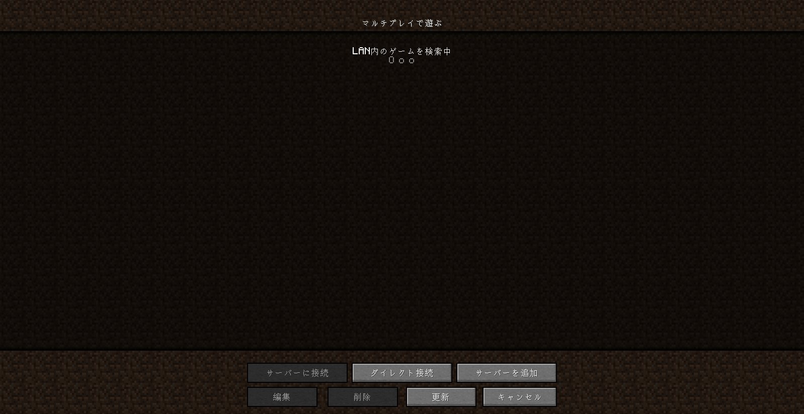
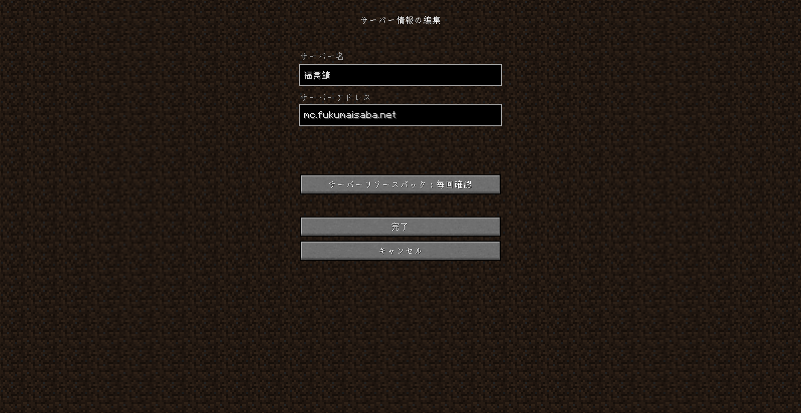

# 福舞鯖へ参加する方法！
Minecraft を起動し、マルチプレイ のメニューに移動します。

次に、「サーバーの追加」をクリックします

`福舞鯖` などのサーバー名を入力し、サーバー IP: `mc.fukumaisaba.net`を入力して、[完了]をクリックします。

追加したサーバーをダブルクリックするか、サーバーを選択して [サーバーに参加]をクリックします。

そうしたら福舞鯖に参加できます！
また、[ルール](https://docs.fukumaisaba.net/rule/)しっかり読み楽しい福舞鯖を遊びましょう！
